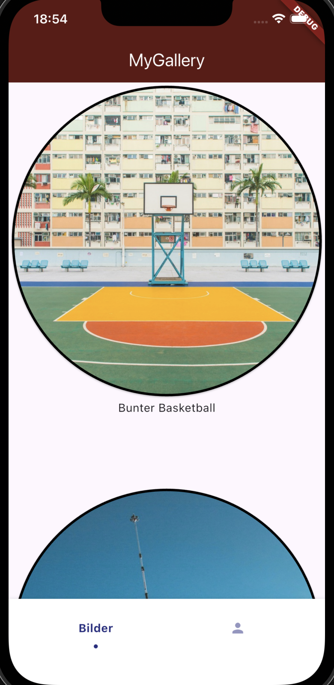

# Flutter Picture Gallery

A simple Flutter gallery app that displays a collection of images and allows navigation to a detailed view using Hero animations.



## 🚀 Features

- Grid-based gallery layout
- Detail screen for each image
- Smooth navigation using Hero animations
- Scrollable detail view
- Clean separation between UI and domain logic

## 🧠 Purpose of the Project

This project was created to deepen my understanding of Flutter and mobile app architecture.

Focus areas:

- Widget composition
- Navigation and routing
- State handling within UI
- Hero animations
- Separation of concerns (domain vs presentation)

## 🏗️ Architecture

The project follows a simplified feature-based structure:

- `presentation` → UI components (widgets, screens)
- `domain` → entities and business logic
- `data` → static data source

This structure helps keep the code modular and maintainable.

## 🛠️ Technologies

- Flutter
- Dart

## ▶️ How to Run

1. Clone the repository:

   ```bash
   git clone https://github.com/domsteindl/pictureGallery
   ```
2. Navigate into the project:

    ```bash
    cd pictureGallery
    ```
3. Install dependencies:
    ```bash
    flutter pub get
    ```
4. Run the app:
    ```bash
    flutter run
    ```

## 📌 Current Status

The core functionality is implemented and working.
The app demonstrates navigation, layouting, and animations.

## 🔮 Future Improvements
- Improve UI/UX design
- Add image loading from API
- Implement state management (e.g. Riverpod)
- Add favorites feature
- Improve animations and transitions

